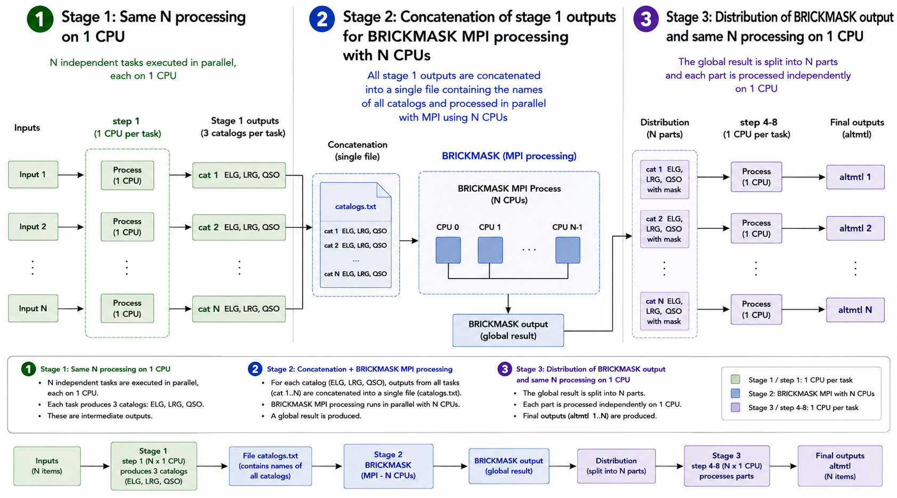

# Intro

**Pipeline under development, pending approval**

This version of the pipeline is designed to generate at least 1,000 catalogs; it therefore uses SLURM's sbatch system rather than the interactive platform, although parts of the pipeline can still be run there. A single submission handles the entire production process, which is configurable via a parameters file.

The pipeline creates various realizations of the observation schedule using the official "fiber assignment" module. The outputs are stored in directories that include an index—like this, 
```console
  ├── seed0000
  │   ├── ELG
  │   ├── LRG
  │   └── QSO
  ├── seed0001
  │   ├── ELG
  │   ├── LRG
  │   └── QSO
```
during the first stages of the pipeline and from stage 7 (Initialize the altmtl directories) onwards.

```console
    ├── altmtl0000
    │   ├── initled
    │   └── Univ000
    ├── altmtl0001
    │   ├── initled
    │   └── Univ000
```

see [Holi pipeline description](../runHoli.md) step by step, here is a summary.


| Step | Script | Short description |
| --- | --- | --- |
| 1 | `script_prepare_holi.sh` | Prepares the Holi mock catalogs for all available realizations in the Y3 footprint. |
| 2 | No script specified | Concatenates simulation files from each seed for the MPI Brickmask version. |
| 3 | `brickmask/script_holi.sbatch` | Runs Brickmask on catalogs without imaging masks. |
| 4 | `join_imaging_mask.py` | Applies the NOBS and MASKBIT imaging masks. |
| 5 | `add_contaminants_to_mock.py` | Adds contaminants to the ELG and QSO samples. |
| 6 | `concatenate_tracers_to_fba.py` | Combines tracers into a `forFA` catalog and creates the QSO file required by AltMTL. |
| 7 | `script_init_holi.sh` / `initialize_amtl_mocks_da2.py` | Initializes AltMTL directories for each realization. |
| 8 | `DR2_altmtl_sbatch/altmtl_200249_holi_v3.sbatch` | Runs the AltMTL realization campaign. |


The pipeline enables the creation of a series of executions with a contiguous index starting with parameter `first_id` in file parameters.



# Define Holi pipeline
 
## 1) Prepare output directory

1. Create directory, in $SCRATCH place to have best I/O performance 
2. Copy nzref files from reference

Actually the input reference is : `/global/cfs/cdirs/desi/mocks/cai/holi/webjax_v4.80`

You can configure it in file parameters, see 2.2

```console
cp /global/cfs/cdirs/desi/mocks/cai/holi/webjax_v4.80/nzref* /pscratch/sd/j/jcolley/holi/webjax_v4.80

login22:webjax_v4.80>ls /pscratch/sd/j/jcolley/holi/webjax_v4.80/
nzref_da2_elg_N.txt
nzref_da2_elg_S.txt
nzref_da2_lrg.txt
nzref_da2_qso.txt
```

note: this path is what you will set as `mock_dir` in the parameter file (see step 4)

[perlmutter scratch doc](https://docs.nersc.gov/filesystems/perlmutter-scratch/)

## 2) Holi pipeline parameters

### 2.1) Clone desihub/LSS package

```console
git clone https://github.com/desihub/LSS.git
cd LSS
LSS_DIR=$PWD
git checkout fa4acm
```

note: this path is what you will set as `LSS_dir` in the parameter file

### 2.2) Copy/edit the parameter file

```console
cd scripts/mock_tools/holi_pipeline
cp holi_params.toml my_run_params.toml
```

Edit `my_run_params.toml` and set at least:

```toml
LSS_dir  = "<LSS_DIR, see step 3.1>"
mock_dir = "<DS_DIR, export PATH=$PWD:$PATHsee step 2>"
first_id = <first seed ID to process>
```

and check the `[brickmask]` section (`cfitsio`, `exe_dir`, `conf_dir`)

### 2.3) Define size of array job 

At the top of `sbatch_holi_pipeline.sh`, modify these 3 parameters

```console
#SBATCH --array=0-7
#SBATCH --ntasks=10
#SBATCH --cpus-per-task=24
#SBATCH -t 36:00:00
```

* `--array` selects how many array ranks (chunks of seeds) are submitted. The array range below only needs to start at 0: SBATCH --array=0-x. The first seed ID to process is set by the "first_id" in file parameters. 
* `--ntasks` is the number of seeds processed per array rank.
* `--cpus-per-task` selects the run mode:
  * `= 1`: **"full" mode**, steps 1 to 8 all run within the same job
    (Fiber Assignment, step 8, only uses 1 CPU per seed). In this case adapt the time ~ 36 hours (?)
  * `> 1`: **"split" mode**, steps 1 to 7 can use the extra CPUs (e.g.
    Brickmask), but step 8 is automatically resubmitted as a separate
    job (`sbatch_step8.shThe first seed ID to process is no longer a command-line argument: it
is read from the `first_id` key of the parameter file (see step 2.2).`) with fewer CPUs per task, so no CPU time is
    wasted during Fiber Assignment.

**Example:**

```console
#SBATCH --array=0-7
#SBATCH --ntasks=10
#SBATCH --cpus-per-task=24
```

will process 8x10 simulations/seed with 10x24 CPUs for BRICKMASK.

## 3) Launch pipeline


Init environment to launch the pipeline , in holi_pipeline directory

```console
source init_env_holi.sh
```

then 

```console
run_holi_pipeline.sh <path/to/parameters/file>
```

a directory like `holi_260831_09h13` (with date) will created in directory log defined with parameter  `logs_dir`


