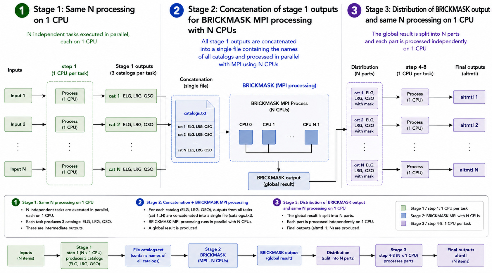
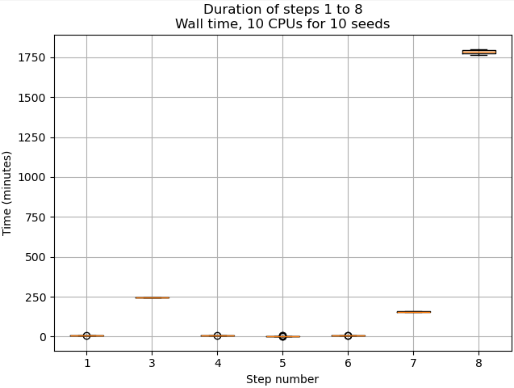

# Pipeline presentation

**Pipeline under development, pending approval**
##  Goal

This version of the pipeline is designed to generate at least 1,000 catalogs; it therefore uses the SLURM batch system rather than the interactive platform, although parts of the pipeline can still be run there. A single submission handles the entire production process, which is configurable via a parameters file.

The pipeline creates various realizations of the observation schedule using the official "fiber assignment" module. The pipeline enables the creation of a series of executions with a contiguous index starting from the `first_id` parameter in the parameter file. The outputs are stored in directories that include an index—like this, 
```console
  ├── seed0000
  │   ├── ELG
  │   ├── LRG
  │   └── QSO
  ├── seed0001
  │   ├── ELG
  │   ├── LRG
  │   └── QSO
```
during the first stages of the pipeline and from stage 7 (Initialize the altmtl directories) onwards.

```console
    ├── altmtl0000
    │   ├── initled
    │   └── Univ000
    ├── altmtl0001
    │   ├── initled
    │   └── Univ000
```

## Pipeline step description

See [Holi pipeline description](../runHoli.md) for a step-by-step description. Here is a summary.


| Step | Script | Short description |
| --- | --- | --- |
| 1 | `prepare_mocks_Y3.py` | Prepares the Holi mock catalogs for all available realizations in the Y3 footprint. |
| 2 | part of sbatch_holi_pipeline.sh | Concatenates simulation files from each seed for the MPI Brickmask version. |
| 3 | `BRICKMASK` | Runs Brickmask on catalogs without imaging masks. |
| 4 | `join_imaging_mask_stdpars.py` | Applies the NOBS and MASKBIT imaging masks. |
| 5 | `add_contaminants_to_mock_stdpars.py` | Adds contaminants to the ELG and QSO samples. |
| 6 | `concatenate_tracers_to_fba_stdpars.py` | Combines tracers into a `forFA` catalog and creates the QSO file required by AltMTL. |
| 7 |  `initialize_amtl_mocks_da2_stdpars.py` | Initializes AltMTL directories for each realization. |
| 8 | `runAltMTL.py` | Runs the AltMTL realization campaign. |


## Pipeline with CPU management
The diagram below describes the pipeline in full mode and its three CPU-management stages.



# Define Holi pipeline
 
## 1) Clone desihub/LSS package

```console
git clone https://github.com/desihub/LSS.git
cd LSS
LSS_DIR=$PWD
git checkout <this branch>
```

note: this path is what you will set as `LSS_dir` in the parameter file

## 2) Copy/edit the parameter file

```console
cd scripts/mock_tools/holi_pipeline
cp holi_params.toml my_run_params.toml
```

Edit `my_run_params.toml` and set at least:

```toml
LSS_dir  = LSS path package
mock_dir = /pscratch/...
first_id = <first seed ID to process>
```

* mock_dir is the output directory, for better performance use /pscratch disk, see [perlmutter scratch doc](https://docs.nersc.gov/filesystems/perlmutter-scratch/)

* for `[brickmask]` section check path (`cfitsio`, `exe_dir`, `conf_dir`)

## 3) Define size of array job 

At the top of `sbatch_holi_pipeline.sh`, modify these 3 parameters

```console
#SBATCH --array=0-7
#SBATCH --ntasks=10
#SBATCH --cpus-per-task=24
```

* `--array` selects how many array ranks (chunks of seeds) are submitted. The array range below only needs to start at 0: SBATCH --array=0-x. The first seed ID to process is set by the "first_id" in file parameters. 
* `--ntasks` is the number of seeds processed per array rank.
* `--cpus-per-task` selects the run mode:
  * `= 1`: **"full" mode**, steps 1 to 8 all run within the same job
    (Fiber Assignment, step 8, only uses 1 CPU per seed). In this case adapt the time ~ 36 hours (?)
  * `> 1`: **"split" mode**, steps 1 to 7 can use the extra CPUs (e.g.
    Brickmask), but step 8 is automatically resubmitted as a separate
    job (`sbatch8_AltMTL.sh`) with fewer CPUs per task, so no CPU time is wasted during Fiber Assignment.

**Example:**

```console
#SBATCH --array=0-7
#SBATCH --ntasks=10
#SBATCH --cpus-per-task=24
```

will process 80 simulations/seeds with 240 CPUs for BRICKMASK.

>NOTE
>
> You can also add your mail to know the beginning and the end of pipeline with option :
>
>#SBATCH --mail-user=<user@mail.xx>

# Launch holi pipeline

Init environment to launch the pipeline , in holi_pipeline directory

```console
source init_env_holi.sh
```

then 

```console
run_holi_pipeline.sh <path/to/parameters/file.toml>
```

a directory like `holi_260831_09h13` (with date) will be created in the directory specified by the `logs_dir` parameter.

```console
login09:holi_pipeline>. init_env_holi.sh

The following have been reloaded with a version change:
  1) cudatoolkit/13.2 => cudatoolkit/13.0

login09:holi_pipeline>run_holi_pipeline.sh /global/homes/j/jcolley/test/my_run_params.toml 
Launch Holi pipeline : /global/cfs/cdirs/desi/users/colley/LSS/scripts/mock_tools/holi_pipeline/sbatch_holi_pipeline.sh
       Log directory : /global/homes/j/jcolley/test/runs/holi_260901_06h56
Submitted batch job 57823814


login09:holi_pipeline>tree /global/homes/j/jcolley/test/runs/holi_260901_06h56
/global/homes/j/jcolley/test/runs/holi_260901_06h56
├── logs
├── my_run_params.toml
└── sbatch_holi_pipeline.sh
```

# Summary of commands

Clone LSS and define file parameters

```console
git clone https://github.com/desihub/LSS.git
cd LSS
git checkout fa4acm
cd scripts/mock_tools/holi_pipeline
nano holi_params.toml 
```

then define size of array job

```console
nano sbatch_holi_pipeline.sh
```

then launch Holi pipeline
```console
source init_env_holi.sh
run_holi_pipeline.sh holi_params.toml 
```

# Bench

## All steps

Overall, the pipeline is dominated by the last step Fiber assignment . Timing by step for `opti_holi1` version




## Step 7, 8
For 303 nights of observation between May 14, 2021, and March 23, 2024, totaling 6,671 fiber assignment files. Step 7 and 8 use 1 CPU in Holi pipeline.

| | Ref | fba lib instead script  |ledger in FITS |
| --- | --- | --- | --- |
| git branch | fa4acm | opti_holi1 | opti_holi2| 
| Step 7 Ledger creation |2h50| 2h50|2h10|
| Step 8  Fiber assignment |42h| 30h|19h|

>NOTE: opti_holi2 includes opti_holi1
# Results

## Traceability

At the root of the log directory defined in the parameter file, you can find a copy of the parameter file and the version of `sbatch_holi_pipeline.sh` that was used.


## Organization of log files

The `logs` directory contains the Slurm output for each job-array rank and a log file for each seed. The BRICKMASK step has a separate log file for each job-array rank. Log files are named `seed_xxx_tyy.log`, where `xxx` is the first seed number assigned to the job-array rank and `yy` is the task number from the `srun` command. The file therefore corresponds to seed number `xxx + yy`.

## Tools to explore results

### Global status of job 

In `check` directory find `check_holi_jobs.py` to obtain status of array jobs and the number of fba_xxxx.fits` file:

```console
$ check_holi_jobs.py /global/homes/j/jcolley/test/runs/holi_260925_04h04
JOB ID      STATUS        ELAPSED     EXIT CODE START               END                 DETAILS                       
----------------------------------------------------------------------------------------------------------------------
58862020    COMPLETED     1-13:11:23  0:0       2026-09-25T04:34 2026-09-26T17:45 completed successfully        
58862023    COMPLETED     1-12:35:11  0:0       2026-09-25T04:33 2026-09-26T17:08 completed successfully        
Found 6671 fba*.fits files in altmtl0050
Found 6671 fba*.fits files in altmtl0051
...
```
 
### Check error

For now, you can search the log files for the word `error`, `kill` using `grep`. If an error occurs, the Slurm log file, `holi_<JOBID>.log`, will contain an error message that identifies the affected task number.


# Holi pipeline for developers

see [doc_holi_dev](doc/doc_holi_dev.md)